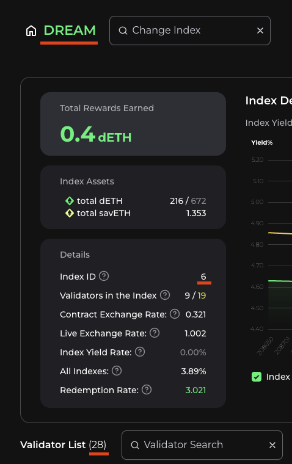

# Steps to investigate the workflow of Syndicate

## 1. Study Overview

First of all, I went through the [Mechanism / WorkFlow](https://docs.joinstakehouse.com/lsd/workflow), and also [Walkthrough Video](https://www.youtube.com/watch?v=7UHDUA9l6Ek) to have a better understanding about Syndicate workflow.

- Syndicate splits the fees into half and distributes first half to MEV staking pool and other half to smart wallets of node runners.

- Each Syndicate is connected with one unique Liquid Staking Manager inside one LSD network.

- Liquid Staking Manager is also connected with one SavETH vault which provides protected deposits where validators can be staked up to 24 ETH for dETH and one Staking Funds which collects 50% of all network rewards from EIP-1559.

- So 32 ETH which will be sent to Ethereum Foundation is collected in this way
  - 4 ETH from Node runner's validator
  - 24 ETH from SavETH Vault
  - 4 ETH from Staking Funds Vault

## 2. Github & Subgraph

After that, I did take an in-depth review for [LSD contracts Github repository](https://github.com/stakehouse-dev/lsd-contracts/) and also checked all the [Subgraph](https://thegraph.com/hosted-service/subgraph/stakehouse-dev/lsd) schemas carefully.

- I fetch based on below query on LSD mainnet subgraph and compare tickers with [monitoring website for mainnet](https://joinstakehouse.com/monitoring?network=mainnet). Those tickers fetched from subgraph are exactly the same ones listed on LSD Indexes.

  ```
  syndicates {
    liquidStakingNetwork {
      ticker
    }
  }
  ```

  ```
  "data": {
    "syndicates": [
      {
        "liquidStakingNetwork": {
          "ticker": "APLAN"
        }
      },
      {
        "liquidStakingNetwork": {
          "ticker": "DREAM"
        }
      },
      {
        "liquidStakingNetwork": {
          "ticker": "DENVR"
        }
      },
      {
        "liquidStakingNetwork": {
          "ticker": "LLSS"
        }
      },
      {
        "liquidStakingNetwork": {
          "ticker": "TAB"
        }
      },
      {
        "liquidStakingNetwork": {
          "ticker": "AAAXL"
        }
      }
    ]
  }
  ```

  But also we can fetch liquidStakingNetworks with any validators.

  ```
  liquidStakingNetworks(where: {numberOfStakedValidators_gt: 0}) {
    ticker
  }
  ```

  ```
  "data": {
    "liquidStakingNetworks": [
      {
        "ticker": "DENVR"
      },
      {
        "ticker": "DREAM"
      },
      {
        "ticker": "APLAN"
      },
      {
        "ticker": "TAB"
      },
      {
        "ticker": "LLSS"
      },
      {
        "ticker": "AAAXL"
      }
    ]
  }
  ```

- Next I tried to find out LSD ranking factor.

  - What I noticed at the beginning is that the Monitoring page shows the LSD networks in the order of Total dETH amount ascending.
    Based on smart contract review, I found dETH is mainly related in `GiantSavETHPool` and `SavETHVault` contracts.

    ```
    giantSavETHPools {
      id
      contractAddress
    }
    liquidStakingNetworks(where: {ticker:"DREAM"}) {
      savETHPool
    }
    ```

    ```
    "data": {
      "giantSavETHPools": [
        {
          "id": "GiantSavETHPool",
          "contractAddress": "0xF5D92B01c478273bD13aA8efb130D98e131ecBB9"
        }
      ],
      "liquidStakingNetworks": [
        {
          "savETHPool": "0x1e8e121c97be5a590f44d0bde9942c107b0be951"
        }
      ]
    }
    ```

    `0xF5D92B01c478273bD13aA8efb130D98e131ecBB9`: This address is `GiantSavETHPool` contract address.<br/>
    `0x1e8e121c97be5a590f44d0bde9942c107b0be951`: This address is `SavETHVault` address for DREAM LSD network.

    But two contracts are all not verified and so many transactions to analyze.<br/>
    If I had more time, I'll try to sum up the amounts of withdrawals.

    `totalPayout` value in Syndicate entity was similar but slightly different.

  - Next, I thought it might be sorted by the number of validators in each LSD network.
    I fetched over subgraph using below query, and the order was as following while it is (`DREAM`, `LLSS`, `AAAXL`, `TAB`, `APLAN`, `DENVR`) on monitoring page, so slightly different.

    ```
    liquidStakingNetworks(
      where: {numberOfStakedValidators_gt: 0},
      orderBy: numberOfStakedValidators,
      orderDirection: desc
    ) {
      ticker
      numberOfStakedValidators
    }
    ```

    ```
    "data": {
      "liquidStakingNetworks": [
        {
          "ticker": "DREAM",
          "numberOfStakedValidators": "28"
        },
        {
          "ticker": "LLSS",
          "numberOfStakedValidators": "3"
        },
        {
          "ticker": "AAAXL",
          "numberOfStakedValidators": "2"
        },
        {
          "ticker": "APLAN",
          "numberOfStakedValidators": "2"
        },
        {
          "ticker": "TAB",
          "numberOfStakedValidators": "1"
        },
        {
          "ticker": "DENVR",
          "numberOfStakedValidators": "1"
        }
      ]
    }
    ```

  So in conclusion, still didn't get what's sorting factor exactly.

- I found a couple of different types of payouts via subgraph.

  - When ETH is distributed to Giant Staking Funds pool

  - When ETH claimed by syndicate

  - When ETH is distributed by syndicate

  ```
  liquidStakingNetworks(where: { ticker: "DREAM" }) {
    id
    feesAndMevPool
  }
  ```

  ```
  "data": {
    "liquidStakingNetworks": [
      {
        "id": "0x12670b896176c37913e62297e059ec5a00d5a171",
        "feesAndMevPool": "0x941208d2a5c02142dbd66e02b84e2c75204a2732"
      }
    ]
  }
  ```

  `0x12670b896176c37913e62297e059ec5a00d5a171`: This address is Liquid Staking Manager contract address, IMO.<br/>
  `0x941208d2a5c02142dbd66e02b84e2c75204a2732`: This address is DREAM LSD network's `feesAndMevPool` address.

  By using this query, I could confirm two of the payout types.

  ```
  payouts(
    where: {
      recipient_in: [
        "0x12670b896176c37913e62297e059ec5a00d5a171",
        "0x941208d2a5c02142dbd66e02b84e2c75204a2732"
      ]
    }
  ) {
    id
    amount
    timestamp
    type
  }
  ```

  So above query returns 57 payouts and all of them are `FEES_AND_MEV_LP` and `NODE_OPERATOR` type payouts.

  ```
  [
    {
      "id": "0x108c6ca201fd045309229ce3fdf6c1bc74fb1a57fafc162b951c08e76fb863d4-139",
      "amount": "4067578835584977",
      "timestamp": "1681032587",
      "type": "FEES_AND_MEV_LP"
    },
    ...,
    {
      "id": "0xf03fc1353548bcf43ce6c8276e75b0429cca65b53570719f572336a90f0dd306-321",
      "amount": "82462064153940895",
      "timestamp": "1685088215",
      "type": "NODE_OPERATOR"
    }
  ]
  ```

  And after that by removing filter in above query, I could see one other type of payouts as well - `GIANT_POOL`.

  ```
  [
    {
      "id": "0xdb962664ec982398162320250fb06aae180438bf6fbe2f8f24c806f61eae6d5d-192",
      "amount": "100140264945445222",
      "timestamp": "1689135107",
      "recipient": "0x3f55db8aa07eaeb4a5541954481eb4b5056301d5",
      "type": "GIANT_POOL"
    },
    ...
  ]
  ```

&nbsp;

## 3. Analyze Monitoring Website

My last focus was about to analyze the LSD networks, especially targeted to [DREAM LSD network](https://joinstakehouse.com/monitoring/index/6?network=mainnet).

- Already confirmed the number of validators is 28 while trying to find out sort algorithm.
- Index ID on site was same as lsdIndex in subgraph.

  ```
  liquidStakingNetwork(id: "0x12670b896176c37913e62297e059ec5a00d5a171") {
    ticker
    lsdIndex
    numberOfStakedValidators
  }
  ```

  ```
  "data": {
    "liquidStakingNetwork": {
      "ticker": "DREAM",
      "lsdIndex": "6",
      "numberOfStakedValidators": "28"
    }
  }
  ```

  

- Compare validators from site and subgraph.

  - Subgraph returns 29 validators but the status of one of them is `BANNED`, while others are all `MINTED_DERIVATIVES`. That's why 28 validators are shown on website.
  - Node runner address can be fetched from subgraph as well.

    ```
      lsdValidators(
        where: { liquidStakingManager: "0x12670b896176c37913e62297e059ec5a00d5a171" }
      ) {
        id
        status
        smartWallet {
          nodeRunner {
            id
          }
        }
      }
    ```

- Still didn't get where most Index Details and Validator values are fetched from.

- [Syndicate contract transactions](https://etherscan.io/txs?a=0x5775fe84096789cd796e7420b5c3c41b2db3e67e) were mainly `ActivateProposers` and `Transfer`.
